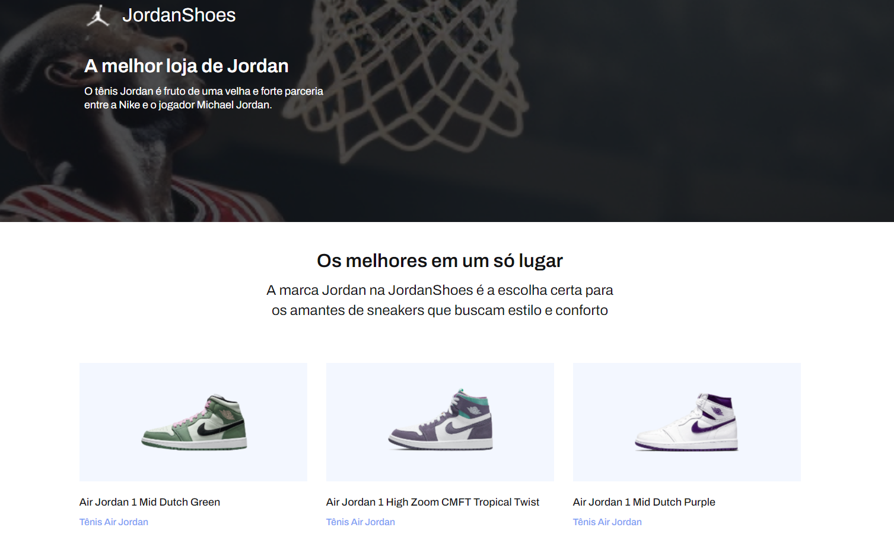

<h1 align="center">
 JordanShoes
</h1>

 
    

  <a href="#-tecnologias">Tecnologias</a>&nbsp;&nbsp;&nbsp;|&nbsp;&nbsp;&nbsp;
  <a href="#-projeto">Projeto</a>&nbsp;&nbsp;&nbsp;|&nbsp;&nbsp;&nbsp;
  <a href="#-funcionalidades">Funcionalidades</a>&nbsp;&nbsp;&nbsp;&nbsp;

  
  

 

## 🚀 Tecnologias
Este projeto foi desenvolvido com as seguintes tecnologias:

- HTML
- CSS
- JavaScript

## 🚧 Sobre o desafio
O desafio reproduzir layout do JordanShoes, que consiste em uma loja de tênis que apresenta alguns tênis.

🔥Live Preview: https://desafio-02-jordanshoes-codelancia.vercel.app/

  
## 🎨 Layout:
Acesse o layout e confira  <a href="https://www.figma.com/file/iq3zQSfAeqwd12nV51D674/Desafios---Codel%C3%A2ndia-(Copy)?node-id=257087%3A234&mode=dev">  FIGMA</a>

---
 
 
Feito com ♥ by RossoniPablo
